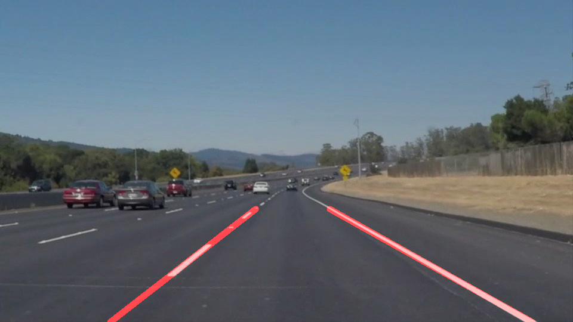

# **Finding Lane Lines on the Road** 

Overview
---

When we drive, we use our eyes to decide where to go.  The lines on the road that show us where the lanes are act as our constant reference for where to steer the vehicle.  Naturally, one of the first things we would like to do in developing a self-driving car is to automatically detect lane lines using an algorithm.

The goals / steps of this project are the following:
* Build a pipeline to find lane lines on the road in images
* Use the pipeline to find lane lines on the road in video

### Reflection

### 1. Describing the pipeline

The pipeline to find lane lines consists of following steps:

1. Convert the original image to grayscale:

    #grayImage = grayscale(image)

The original RGB image is converted to grayscale to reduce the color channels. It is easier to process an image this way.

2. Convert the grayscale image to blurred image

    #blurredImage = gaussian_blur(grayImage, kernel_size)

Use the gaussian blur function to blur the grascale image. The gaussian blur further reduces the noise in input grayscale image.

3. Find the edges

    #edgeImage = canny(blurredImage, low_threshold, high_threshold)

A canny edge detector is used to detect strong edges in the blurred image. 

4. Region of interest

    #imshape = image.shape
    #vertices = np.array([[(0,imshape[0]),(500, 270), (imshape[1], imshape[0]), (imshape[1],imshape[0])]], dtype=np.int32)
    #maskedImage = region_of_interest(edgeImage, vertices)

A region of interest is identified in the image where it is probable of finding the lanes. This reduces the computations required on the whole image. All the pixels which do not belong in this region of interest is removed. This is called masked image.

5. Hough Transformation

    #rho = 1
    #theta = np.pi/180.0
    #threshold = 5
    #min_line_len = 30
    #max_line_gap = 2
    #lineImage = hough_lines(maskedImage, rho, theta, threshold, min_line_len, max_line_gap) 

From the masked image, hough transformation is used to find all the line segments in the image. The function returns a blank image(black background) with lanes drawn on it.

6. Extending the draw_line function

In order to use the lines returned by the hough transform and draw them on the original image, several modifications were done to the draw_line function which are described below:

      #calculate slope and intercept of each line
      #m = float(y2-y1) / float(x2-x1)
      #b = float(y1) - float(x1*m)
            
      #lines belong to left lane
      #if x1 < xMidPoint and x2 < xMidPoint:
        #linesLeft.append(line)
        #slopeLeft.append(m)
        #interceptLeft.append(b)
            
      #lines belong to right lane    
      #elif x1 > xMidPoint and x2 > xMidPoint:
        #linesRight.append(line)
        #slopeRight.append(m)
        #interceptRight.append(b)
            
      #assign lines to left lane    
      #else:
        #linesLeft.append(line)
        #slopeLeft.append(m)
        #interceptLeft.append(b)

For each line returned by the hough transform, slope and intercept is calculated. Then, the lines are separated as belonging to left or right lanes depending on whether the value is less than midpoint of the image or greater than the midpoint of the image respectively.

       #x1Left = (yMax - meanInterceptLeft)/meanSlopeLeft
       #y1Left = yMax
       #x2Left = (yMin - meanInterceptLeft)/meanSlopeLeft
       #y2Left = yMin

       #x1Right = (yMax - meanInterceptRight)/meanSlopeRight
       #y1Right = yMax
       #x2Right = (yMin - meanInterceptRight)/meanSlopeRight
       #y2Right = yMin

With the help of individual line segments, an extrapolated single line is calculated for each side of the lane. The co-ordinates of such an extrapolated line is calculated as shown above. The line starts from bottom of the image and ends at the pixel defined by yMax.

7. Draw lines on the original RGB Image

The last step is to draw the extrapolated lanes on the original RGB image. 

       #if lineImage is not None:
         #lastValidLineImage = copy.copy(lineImage)
         #lastValidImage = copy.copy(originalImage)

Sometimes, it was observed that hough_lines function returned null image, which meant no lines were detected. This is a problem for the video data as every such frame will have only the original image displayed which resulted in poor video output. To overcome this problem, if the line image and original image are found to be valid, they are stored separately as lastKnown images and used whenever there is a null line image returned. 

       #if lineImage is None:
         #print "nonetype found"
         #finalImage = weighted_img(lastValidLineImage, lastValidImage)
                   
       #else:
         #finalImage = weighted_img(lineImage, image)

Here, the finalImage is the original RGB image with lanes drawn on it. 

### 2. Identify potential shortcomings with your current pipeline

One of the potential shortcoming would be when the lines detected by the hough transform are on either side of the image midpoint. Currently, they are considered as belonging to left lane.

Changing lanes, left and right turns are not handled.

different weather conditions may change the perspective of the input image which is not handled right now.

Another shortcoming is that, if a vehicle is present in the region of interest the lanes are drawn on them too

### 3. Suggest possible improvements to your pipeline

Consider the possible case of lines belonging to either side of the midpoint. Sort them based on how far they are from the midpoint.

Consider tracking of lanes to make the detection smooth.

Give a confidence measure to the detection.

Use color filter as an initial filter along with Region of Interest.

